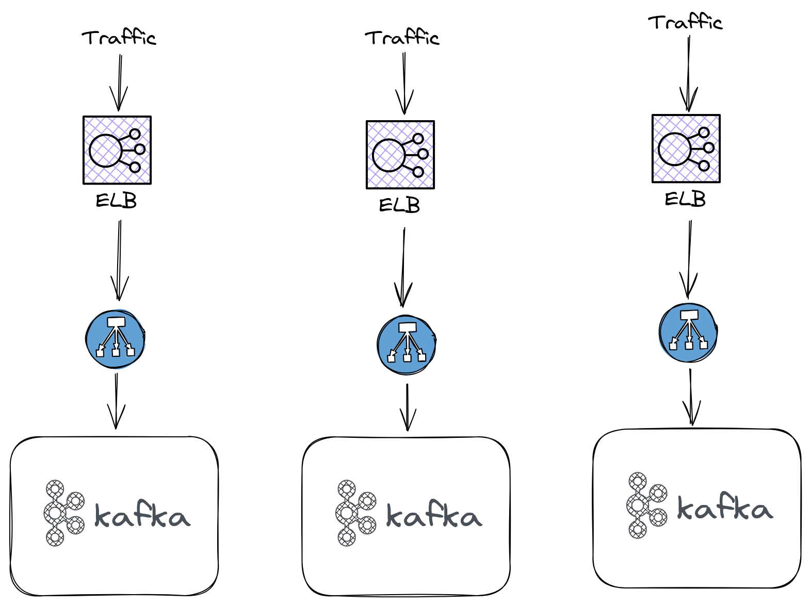
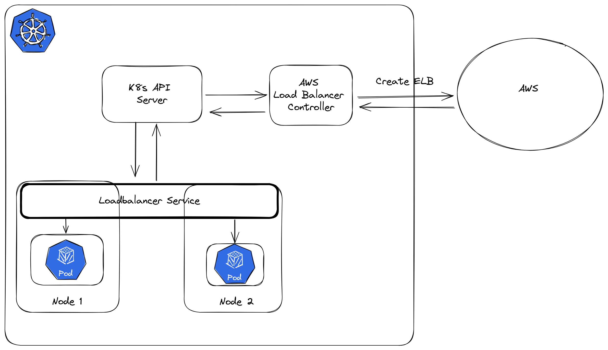
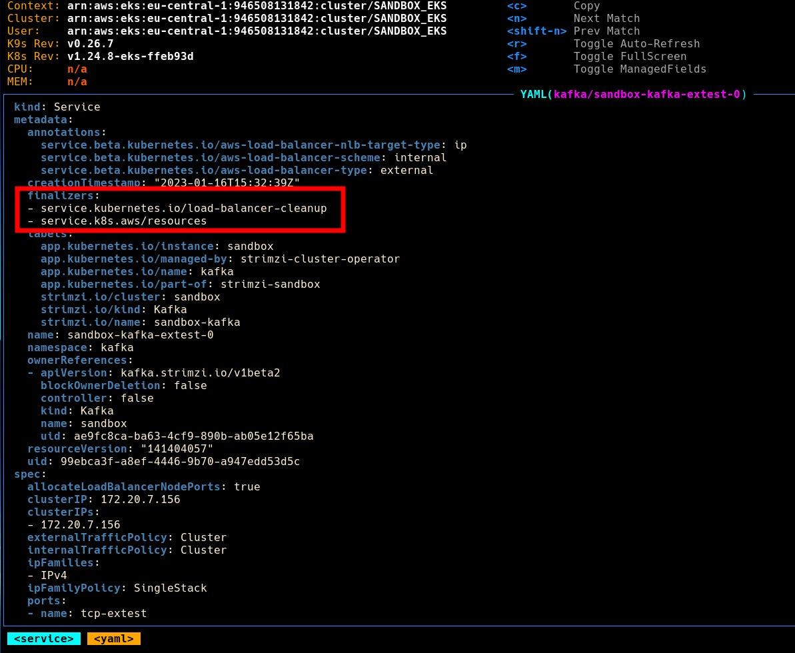
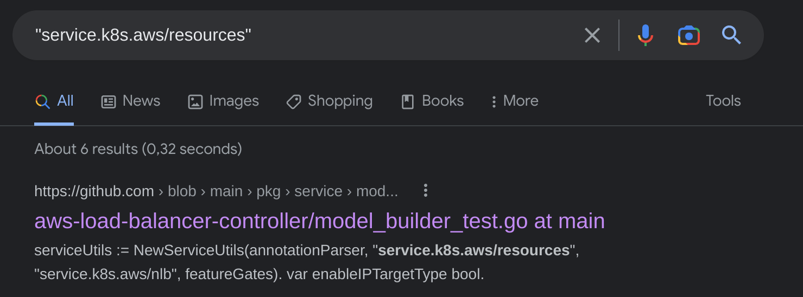
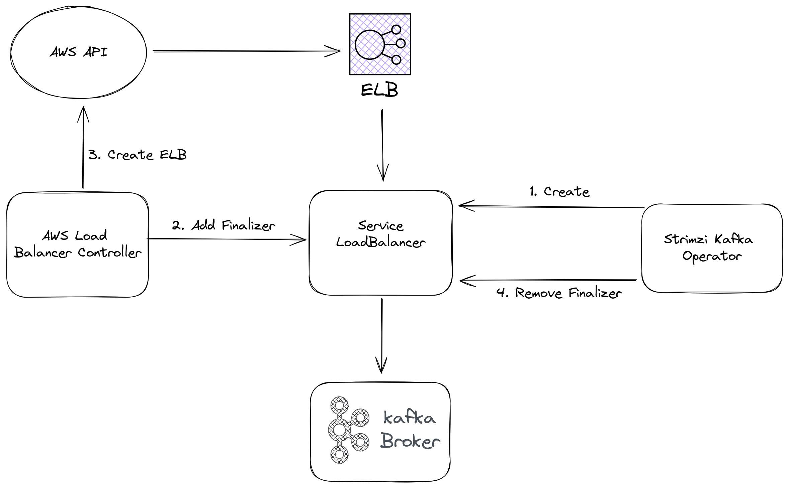

I want to take you on a tour into a special case where we ended up with dangling load balancers on AWS
when deleting a service of type LoadBalancer in Kubernetes. As I was still rather new to Kubernetes when I came across this case, it made my feel like I was losing my sanity.

Let me start by giving you some background knowledge on the two components that were involved in this case, Strimzi Kafka Operator and AWS Load Balancer Controller.

## Kafka on Kubernetes

We are using kafka at work, deployed on kubernetes using the Strimzi kafka operator.
Furthermore, we are exposing kafka using load balancers, as has been showcased on the Strimzi blog.

To give clients access to the individual brokers, the operator creates a separate service of type LoadBalancer for each broker. As a result, each broker will get also have a separate load balancer in the cloud.

This leads to a slightly odd architecture, as shown in the diagramm below, assuming you have 3 brokers in your kafka cluster.



None of these load balancers are actually balancing any load, they just serve as entrypoints for each individual kafka broker.

It is also worth mentioning that these load balancers on AWS are Network Load Balancer (NLB). Network load balancers act on layer 4, this enables them to serve traffic with a lower latency and at less cost than the layer Application Load Balancer (ALB) but they also don’t offer features such as authentication, sticky sessions or request based routing.

We can find a simple answer as to why they went with NLBs over ALBs on the strimzi blog

> Since none of the common load balancing services supports the Kafka protocol, Strimzi always uses the Layer 4 load balancing.

## AWS Load Balancer Controller

As you saw in the last image, for each broker we need a service of type LoadBalancer. We are running our entire infrastructure on AWS, so for us each of these services maps to an external load balancer in the cloud, an ELB.

These load balancers on AWS are automatically created for us by the AWS Load Balancer Controller. This is generally great as we don’t have to worry about managing these load balancers, we just create a service of type LoadBalancer in Kubernetes and the controller takes care of creating and managing the ELB automatically.



It also takes care of deleting the load balancer on AWS once we delete the service in our cluster. To achieve this it adds a finalizer to the definition of all services (and ingresses) that it created a cloud resource for.

For an explanation of how finalizers work have a look at last weeks episode or the finalizers documentation.

## Where did my finalizer go?

We noticed that when removing the LoadBalancer services that connect to Kafka in our cluster, the ELBs on the side of AWS are still there even tho they don’t serve a purpose anymore.

First I checked the current yaml definition of our load balancers, created by the strimzi operator. There were no finalizers, which is clearly why the load balancers in AWS didn’t get deleted. Which leaves only one question to be answered, why are the finalizers missing?

During research I found this issue in the strimzi operator repo according to which support for finalizers should have been added around march 2021. Furthermore a second issue in the same repository suggest adding the following.

```
finalizers:
- service.kubernetes.io/load-balancer-cleanup
```

I had to look up what this is supposedly doing and found a straight forward explanation.

> Specifically, if a Service has type LoadBalancer, the service controller will attach a finalizer named service.kubernetes.io/load-balancer-cleanup. The finalizer will only be removed after the load balancer resource is cleaned up. This prevents dangling load balancer resources even in corner cases such as the service controller crashing.

Now, in hindsight, I should have paused here for a moment and ask myself why the service controller, who is supposed to add this finalizer, apparently didn’t do it. That’s not what I did tho, instead I rushed towards my editor and added this finalizer myself.

```
apiVersion: kafka.strimzi.io/v1beta2
kind: Kafka
metadata:
  name: {{ .Values.cluster_name }}
  namespace: {{ .Values.namespace }}
spec:
  kafka:
    version: {{ .Values.kafka_version }}
    replicas: {{ .Values.kafka_replicas }}
    authorization:
      type: simple
      superUsers:
        - admin
    listeners:
      - name: plain
        port: 9095
        type: internal
        tls: false
        authentication:
          type: scram-sha-512
        configuration:
          useServiceDnsDomain: true
      - name: external
        port: {{ .Values.kafka_port }}
        type: loadbalancer
        tls: true
        authentication:
          type: scram-sha-512
        configuration:
          finalizers:
            - service.kubernetes.io/load-balancer-cleanup
        ...
```

With this change deployed in one of our test environments I used k9s to confirm the presence of this finalizer.

What I saw really suprised me tho, there are suddenly not just one but two finalizers present.

- service.kubernetes.io/load-balancer-cleanup
- service.k8s.aws/resources



At that time I didn’t know where this second finalizer came from and felt super confused.

Things got worse when I tried to delete this service and saw it being removed instantly. Normally when a finalizer is present, this should take a few seconds for the controller to remove the cloud resource.

I went over to the AWS console and, of course, the load balancer is still there. The controller did not remove it even tho the service of type LoadBalancer was deleted. The added finalizer did not work.

I had no idea what was going on at this point but this other finalizer that had appeared, service.k8s.aws/resources, seemed to be worth investigating.



Great, the first hit is a code reference on Github, I already thought this would be a deep rabbithole to go down. Then I noticed the name of the rep aws-load-balancer-controller - so this other finalizer had to be related to it.

Then it dawned on me, the operator first creates the service of type LoadBalancer, then the load balancer controller adds the finalizer (service.k8s.aws/resources) to it and so far everthing is good but then the operator removes the finalizer in his reconciliation loop.

When I saw both finalizers being present, the operator must have removed the service.k8s.aws/resources just before I could delete the service.



In this case when we remove the service type LoadBalancer, the ELB we will not be deleted. Without the finalizer the service gets deleted immediately and the AWS Load Balancer Controller has no idea that it has to get rid of the cloud load balancer.

When we now go back to the defintion file and replace service.kubernetes.io/load-balancer-cleanup with service.k8s.aws/resources then the whole things works as intended.

```
apiVersion: kafka.strimzi.io/v1beta2
kind: Kafka
metadata:
  name: {{ .Values.cluster_name }}
  namespace: {{ .Values.namespace }}
spec:
  kafka:
    version: {{ .Values.kafka_version }}
    replicas: {{ .Values.kafka_replicas }}
    authorization:
      type: simple
      superUsers:
        - admin
    listeners:
      - name: plain
        port: 9095
        type: internal
        tls: false
        authentication:
          type: scram-sha-512
        configuration:
          useServiceDnsDomain: true
      - name: external
        port: {{ .Values.kafka_port }}
        type: loadbalancer
        tls: true
        authentication:
          type: scram-sha-512
        configuration:
          finalizers:
            - service.k8s.aws/resources
```

Now there is only one finalizer present and it’s the one that the AWS Load Balancer Controller understands.

Deleting the service again will take a few seconds, as it should, and leaves no cloud load balancer behind.

## Lessions learned

1. Finalizers are just a string that your controller understands. Adding the finalizer service.kubernetes.io/load-balancer-cleanup didn’t help because it’s not what the AWS Load Balancer Controller was expecting.
2. When something is missing from or unexpectedly added to a service defintion and the service is handled by an operator, there is a good chance that the operator is to blame. Keep the reconciliation loop in mind when troubleshooting such cases.

## Closing Words

In this post I tried to share the whole process of fixing this issue, including all the gaps in my knowledge that I had and how I closed them.

This article is free but if you want to encourage me to keep doing this you can buy me a coffee.
