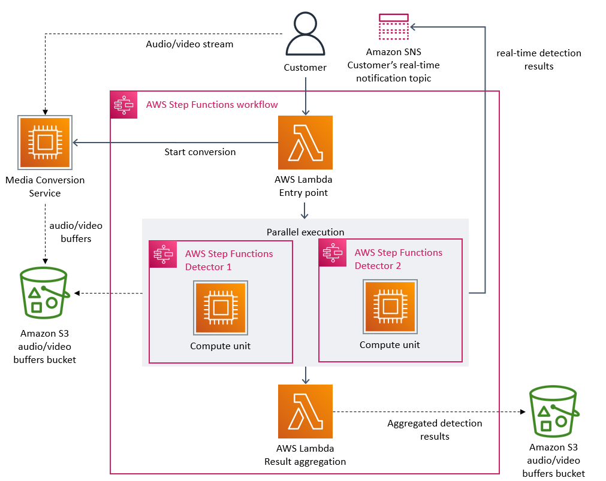
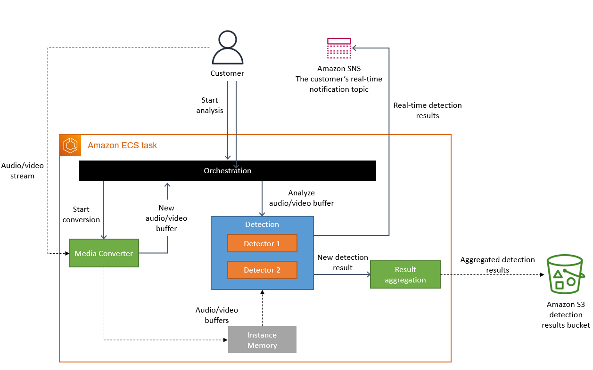
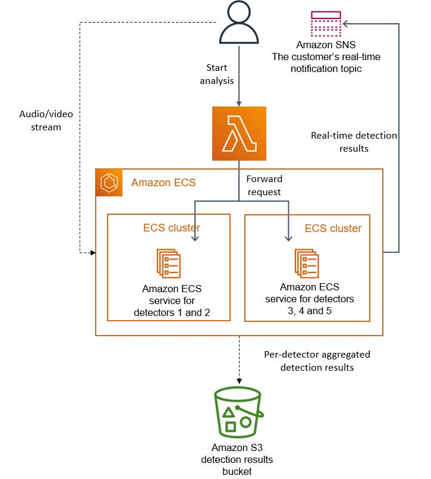

I came across this article the other day when it was all over reddit. 
I couldn’t help but notice that a lot of people seem to take this as 
“we should stop doing microservices all together and go back to building monoliths” 
and I want to elaborate on why I don’t think that was the point of the article at all and what we should take away instead.

Let’s first first clarify that this article isn’t talking about all of prime video but only about one tool, 
that one team at Prime Video uses.

> Our Video Quality Analysis (VQA) team at Prime Video already owned a tool for audio/video quality inspection, but we never intended nor designed it to run at high scale

One can assume that the entirety of Prime Video still consists of a microservice architecture, 
evidence for which can be found in one of their other blog posts, and the article above never suggested otherwise.
One fellow redditor has said it best:

> You can make a wall out of bricks, and it can be better using 200 bricks vs 5 big blocks, but not using 400,000 bricks.

Emphasizing that they are still using a microservice architecture for prime video, 
but for this particular service they had split it up too much and found a bigger service to be more beneficial.

So, let’s take a closer look at why the split into multiple microservices wasn’t the right approach in this case. 
The following image shows their initial microservice based architecture.

Quoting from the article:

> The two most expensive operations in terms of cost were the orchestration workflow and when data passed between distributed components

Now, looking at the diagram above, a high cost for data flow is not all that surprising 
with the media conversion service uploading everything to an S3 bucket first which is 
then to be accessed by the detectors running on the step functions.

But another factor that played a huge role in this was the cost of the step functions. 
I am again quoting from the original article:

> Our service performed multiple state transitions for every second of the stream

Currently, the price for AWS step functions sits at $0.025 per 1,000 state transitions. If we assume that by “multiple” they mean 3, 
which is probably a generous assumption, then streaming for one hour would result in

MATH

0.27$ for one hour of streaming. This really shows that, while serverless options are often are great 
way to get started in developing new services and applications, they can get absurdly expensive under heavy workloads.

With this new approach they did run into a problem tho, they got to a point where they couldn’t add any more detectors 
to the single EC2 instance - a classic problem when running a monolith. They solved this by creating multiple copies 
of the services with different detectors running on them and added an orchestration layer on top.

Now, looking at the end result, only two things have really changed.

1. They are now using EC2 based ECS tasks for their computation instead of serverless step functions.
2. They integrated the media conversion directly into the detectors

The first change is cheaper for them because step functions get ridiculously expensive at scale, as we saw in the example calculation.
The second change eliminates the intermediate S3 bucket which was frequently accessed, making it an expensive component as well.

Of course, all of this is easy for me to write now looking at their article with all the benefit of hindsight. Making the decision to re-architect something that is already running in production is never easy and making the call to use less of the prominent microservice based approach and instead couple things closer together must have been even harder. My respect to the engineers who made this decision and congratulations to their achievements. Please go and read their article, it’s much better than this one.

##Closing Words

I hope got value out of this and consider leaving your email address so that you don’t miss out on any of my future posts. I am also just a human who makes mistakes, so if you think anything here is wrong, please let me know.
If you want to encourage me to keep doing this you can buy me a coffee.
