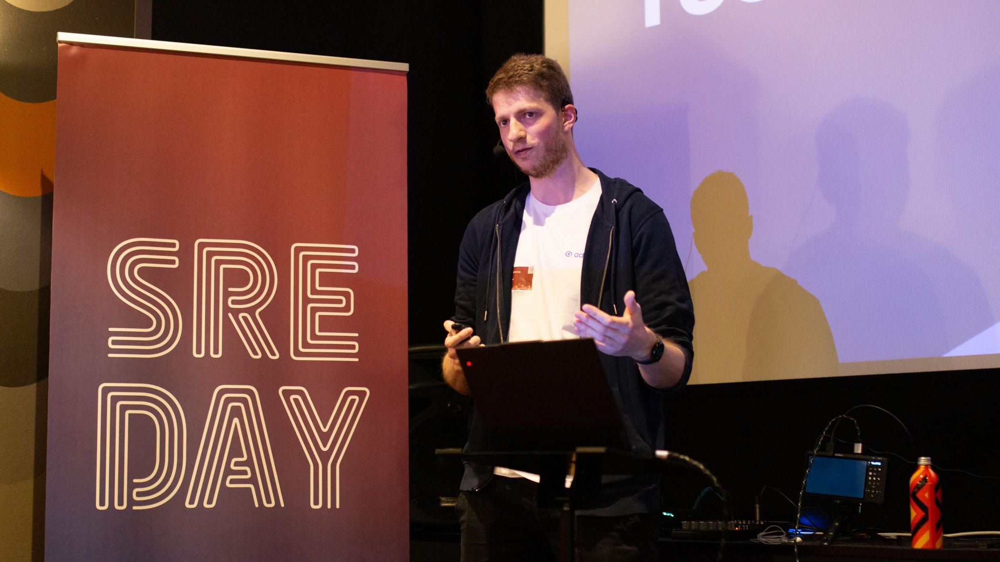

Last Friday, 28.03.2025, I gave my first ever talk at a tech conference, [SREday London 2025](https://sreday.com/2025-london-q1/).
Today I wanted to reflect on that experience, which was been a great one overall for sure. I really enjoyed the vibe of the conference, 
it was very chill with these cozy cinema rooms to watch the talks and no one was really trying to sell me anything - sure there were a few booths 
from vendors sponsoring the event but they weren't aggressively trying to make contact with you. 

(btw am I still allowed to use the word "vibe" or has "vibe coding" ruined it already?) 

When it comes to networking at these kind of events, I always find myself struggling starting a conversation with people.
As such I am always super grateful when other people take over that hard part and start talking to me. This time there where
[Jonathan Perry](https://www.linkedin.com/in/yonch/) and [Jorge Lainfiesta](https://www.linkedin.com/in/jrlainfiesta/) who took the initiative of talking to me, thanks a lot for that. 
In both cases I again didn't feel like I was being sold on anything, just tech people nerding out about tech and I loved it.

I also liked the organization of the whole event, these cinema rooms really helped to give the whole thing a chill atmosphere - it never felt like 
giving or receiving a lecture, more like hanging out and telling stories. 

If I had to critize anything it would probably be the dinner where instead of taking peoples names the waiters would take your location with your order - so once you 
ordered you where not supposed to move around anymore. Especially for the context of a conference where you are supposed to talk to a lot of different people this seemed like
a rather odd decision. Perhaps it was an attempt at Chaos Engineering? 

Overall an amazing event and I was really happy with my experience speaking in public on a tech conference.
